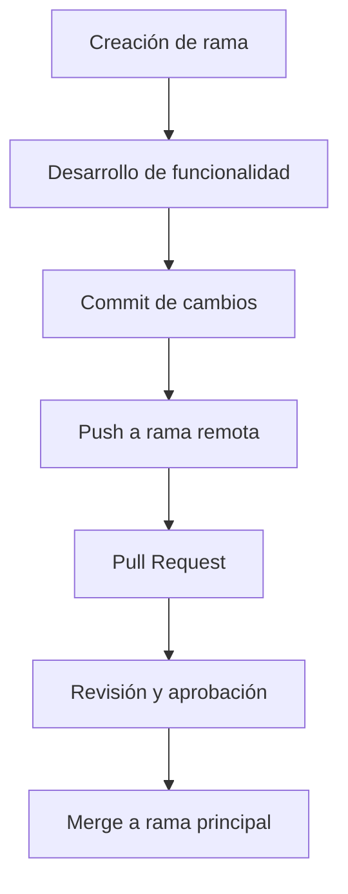

# gestor_alumnos

Ejercicio colaborativo. Python. Gestor de alumnos (v2)

---

# Descripción del Proyecto

Este proyecto tiene como objetivo practicar en un mini-proyecto colaborativo el uso de git y guthub entre varios integrantes.

URL: [https://github.com/FCS-dev/gestor_alumnos]()

Participantes y Tareas

- **Participante 1**: Jose Salazar  / Responsable de  `funciones_alumnos.py` (añadir, listar, buscar)
- **Participante 2**: Ignacio Martin / Responsable de `estadisticas.py`(nota media, máxima y mínima)
- **Participante 3**: Franco Calderón / Responsable de la Documentación y README
  *(Agrega o edita los nombres y tareas según corresponda)*

## Flujo de Commits

A continuación se muestra el flujo típico de commits en este proyecto:

Si prefieres una imagen, puedes crear un diagrama y subirlo aquí, por ejemplo:

---
